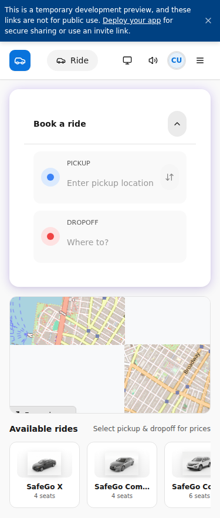
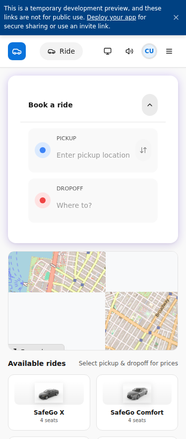
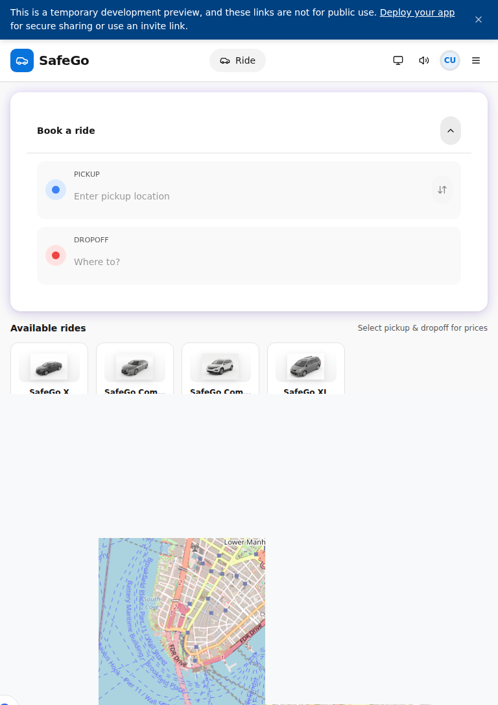
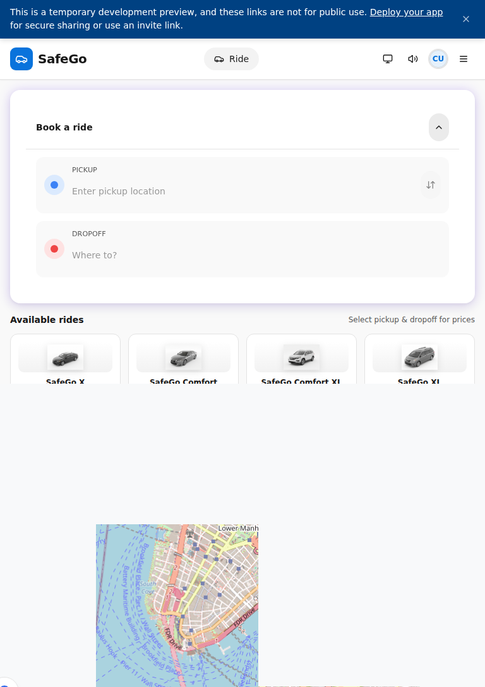
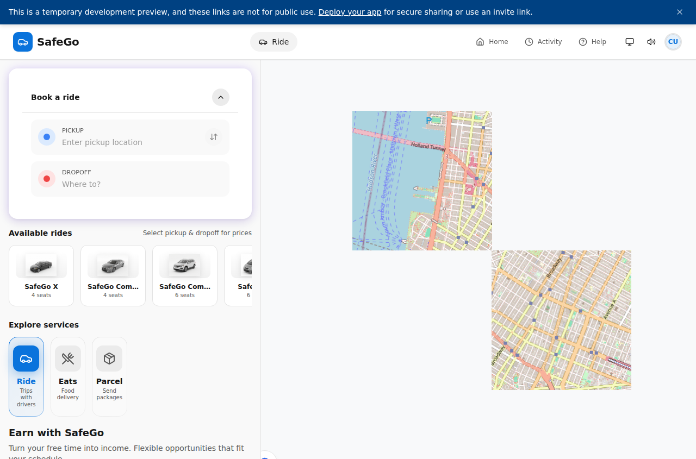
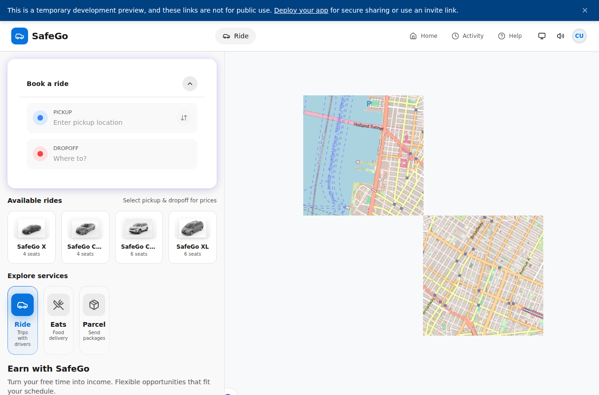

# SafeGo Customer Booking - Responsive UI Comparison

## Overview
This document shows BEFORE/AFTER screenshots of the customer booking interface at three viewport sizes.

## Changes Made
The responsive improvements include:
1. **Route Selection Pills**: Added `snap-x snap-mandatory` for smooth mobile swiping
2. **Ride Category Cards**: Changed from horizontal scroll (`flex gap-3 overflow-x-auto`) to responsive grid (`grid grid-cols-2 gap-3 md:grid-cols-4`)
3. **Service Type Pills**: Added `snap-x snap-mandatory` for improved touch navigation

## Screenshots by Viewport

### Mobile (375px x 812px)
| BEFORE | AFTER |
|--------|-------|
|  |  |

**Mobile Changes:**
- Route pills now snap to positions during horizontal scroll
- Ride category cards display in a 2-column grid instead of horizontal scroll
- Improved touch-friendly navigation with snap scrolling

### Tablet (768px x 1024px)
| BEFORE | AFTER |
|--------|-------|
|  |  |

**Tablet Changes:**
- Grid layout provides better use of wider screen real estate
- 2-column grid for ride categories fits tablet width naturally
- Consistent spacing and alignment

### Desktop (1280px x 800px)
| BEFORE | AFTER |
|--------|-------|
|  |  |

**Desktop Changes:**
- Full 4-column grid for ride categories at `md:` breakpoint and above
- No horizontal scrolling needed - all options visible at once
- Professional grid layout similar to Uber's interface

## Code Changes Summary

### Line ~2371 (Route Selection Pills)
```diff
- className="flex gap-2 overflow-x-auto pb-1 -mx-1 px-1"
+ className="flex gap-2 overflow-x-auto snap-x snap-mandatory pb-1 -mx-1 px-1"
```

### Line ~2920 (Ride Category Cards)
```diff
- className="flex gap-3 overflow-x-auto pb-2"
+ className="grid grid-cols-2 gap-3 md:grid-cols-4"
```

### Line ~3883 (Service Type Pills)
```diff
- className="flex gap-2 overflow-x-auto pb-2"
+ className="flex gap-2 overflow-x-auto snap-x snap-mandatory pb-2"
```

## Testing Instructions
1. Open `/customer` in browser
2. Test at each viewport size using DevTools device emulator
3. Verify horizontal pill sections snap correctly on mobile
4. Verify ride cards show in grid layout (2 cols mobile, 4 cols desktop)
